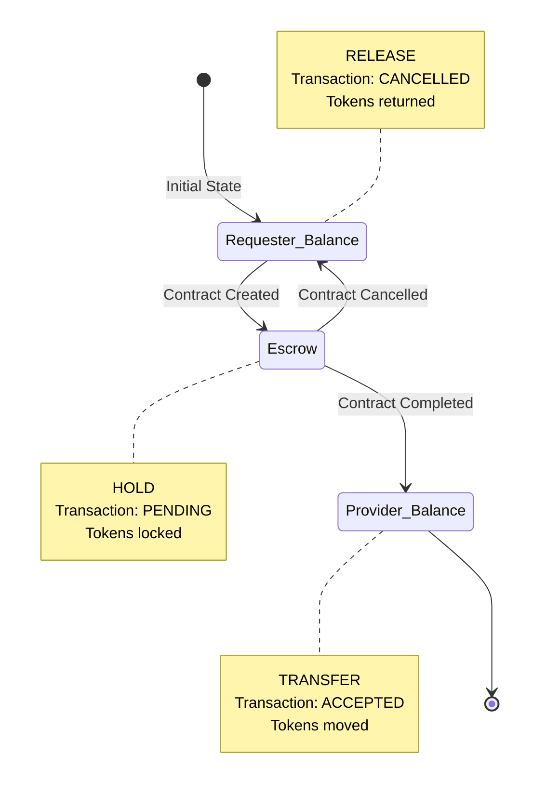

# 🤝 Manfaa – B2B Service Exchange Platform  

## Overview  
**Manfaa** is a backend system that aggregates B2B service exchange opportunities in Saudi Arabia.  
It enables companies to easily find and offer professional services through two exchange mechanisms, while managing the complete lifecycle from request to delivery.  

Companies gain access to **Token-based payments or Barter exchanges** with secure escrow and bilateral contract approval.  

---

## Features  

### Company  
- Sign up / Login.  
- Create company profile (name, industry, team size, description).  
- Manage skills portfolio (assign/remove from available skills).  
- **Service Requests**:
  - Create requests (Token/Barter/Either exchange type).
  - Specify deliverables, timeline, and budget.
  - Update or delete OPEN requests.
  - Browse and filter by category, exchange type, token range, date range.
  - Sort by token amount (ascending/descending).
- **Bidding**:
  - Submit competitive bids with pricing and timeline.
  - Update or delete PENDING bids.
  - Accept or reject received bids (as requester).
  - Receive email notifications on bid decisions.
- **Contracts**:
  - Create contracts from accepted bids.
  - Bilateral approval required (both parties must accept).
  - Track status (PENDING → ACTIVE → COMPLETED).
  - Mark delivery complete with proof.
  - Extend contract time once (50% of original duration).
  - Cancel or reject contracts.
  - **Token Escrow**: Secure payment held until completion.
- **Credits**:
  - View token balance, total earned, total spent.
  - View transaction history.
  - Purchase tokens via payment gateway.
- **Reviews**:
  - Rate completed contracts (1-5 stars, decimals allowed).
  - Write review descriptions (min 10 characters).
  - View received and written reviews.
  - Update or delete own reviews.
  - Search reviews by keyword.
  - Filter by exchange type.
  - Sort by rating (best to worst).
- **Subscriptions**:
  - Subscribe monthly (120 SAR) or yearly (1,200 SAR).
  - Benefits: Priority search, higher support priority, premium badge.
  - Cancel anytime (active until period end).
- **Support Tickets**:
  - Create tickets (CONTRACT/SUBSCRIPTION/PLATFORM/SUGGESTION).
  - Auto-priority based on category and subscriber status.
  - Update or delete OPEN tickets.
  - Track resolution status.
- Email notifications for bids, contracts, reviews, refunds, and tickets.

### Admin  
- View all users.  
- Add new admins.  
- Update or delete users.  
- Delete company profiles.  
- **Categories** (10 categories):
  - Web Development, Mobile Development, Digital Marketing.
  - Graphic Design, Content Writing, Video Production.
  - Data Analysis, IT Consulting, Cloud Services, Cybersecurity.
  - Add, update, delete categories.
- **Skills** (10+ skills):
  - React.js, Node.js, Python, Java, Flutter.
  - AWS, Docker, PostgreSQL, MongoDB, Machine Learning.
  - Add, update, delete skills.
  - Search skills by keyword.
- **Monitoring**:
  - View all reviews, tickets, transactions, subscriptions.
  - Resolve tickets.
  - View all company credits.
- **Operations**:
  - Process credit refunds.
  - Add credits to companies.
  - Handle contract rejections and refunds.

---

## Tech Stack  
- **Backend:** Spring Boot 3, Spring Security, Hibernate/JPA  
- **Database:** MySQL  
- **Email Service:** JavaMailSender (SMTP)  
- **Payment Gateway:** Integration ready (Moyasar/Stripe compatible)  
- **Authentication:** JWT (JSON Web Tokens) with HTTP-only cookies  
- **Password Encryption:** BCrypt  
- **Authorization:** Role-based (`COMPANY`, `ADMIN`)  
- **Build Tool:** Maven  

---

## Diagrams

### Database Schema
```mermaid

```
#### Contract Lifecycle
```mermaid
stateDiagram-v2
    [*] --> PENDING: Contract Created
    
    PENDING --> ACTIVE: Both Parties Accept
    PENDING --> CANCELLED: Either Party Rejects
    
    ACTIVE --> COMPLETED: Both Mark Delivered
    ACTIVE --> CANCELLED: Contract Cancelled
    ACTIVE --> DISPUTED: Support Ticket
    
    DISPUTED --> CANCELLED: Admin Refunds
    DISPUTED --> COMPLETED: Admin Resolves
    
    COMPLETED --> [*]
    CANCELLED --> [*]
    
    note right of PENDING
        Tokens in escrow
        Awaiting approval
    end note
    
    note right of ACTIVE
        Work in progress
        Can extend once
    end note
    
    note right of COMPLETED
        Tokens transferred
        Reviews enabled
    end note
```

#### Token Escrow System


---

### Links

- [🎨 Figma Design](https://www.figma.com/site/3bPA8IWIxBTUWX803YicFz/Manafaah?node-id=0-1&p=f&t=eFcKHpnWZnGD9ogl-0)
- - [ Postman ](https://documenter.getpostman.com/view/46904242/2sBXVbJZbv) 


---

## Enhancements & Creative Improvements
- **Token Escrow System**: Secure three-state token lifecycle (HOLD → RELEASE/TRANSFER) ensures transaction integrity.  
- **Dual Exchange Types**: Flexible payment options (Tokens, Barter, or Either) for diverse B2B business needs.  
- **Bilateral Contract Approval**: Both requester and provider must approve contracts before activation.  
- **Email Automation**: Automated notifications at every step (bids, contracts, reviews, refunds).  
- **Advanced Review System**: Transparent feedback with search, filtering, and sorting capabilities.  
- **Subscription Model**: Monthly (5 SAR) and yearly (50 SAR) plans with priority features.  
- **Smart Ticket Prioritization**: Automatic priority assignment based on category and subscriber status.  

---

## Summary
Manfaa is designed to be a **full-featured backend solution** for B2B service exchange in Saudi Arabia.  
It balances **service requester convenience, provider opportunities, and admin control**, while integrating **secure token escrow, bilateral contract approval, and comprehensive dispute resolution**.  
With clear data modeling, automated email notifications, and robust review system, Manfaa provides a complete ecosystem for B2B service operations.  

---

# API Endpoints Summary

| Controller | Count |
|---|---:|
| AuthController | 2 |
| UserController | 4 |
| CompanyProfileController | 7 |
| CategoryController | 4 |
| SkillsController | 8 |
| ServiceRequestController | 20 |
| ServiceBidController | 6 |
| ContractAgreementController | 6 |
| ReviewController | 11 |
| TicketController | 15 |
| SubscriptionController | 4 |
| CompanyCreditController | 2 |
| CreditTransactionController | 5 |
| PaymentController | 2 |
| **Total** | **100** |

---

## AuthController (`/api/v1/auth`)
| Method | Path | Description |
|---|---|---|
| POST | `/login` | User login (returns JWT token) (mohammed) |
| POST | `/logout` | User logout (clears JWT cookie) (mohammed) |

---


## CompanyProfileController (`/api/v1/company`)
| Method | Path | Description |
|---|---|---|
| POST | `/register` | Register new company (nawaf) |
| GET | `/get-all` | Get all company profiles (brief) (nawaf) | 
| GET | `/get-companies-full` | Get all companies with full details (nawaf) | 
| GET | `/get-company-full` | Get authenticated company's full profile (nawaf) | 
| GET | `/get-company-id-full/{companyId}` | Get company by ID with full details (nawaf) | 
| PUT | `/update/{companyId}` | Update company profile (nawaf) | 
| DELETE | `/delete/{companyId}` | Delete company profile (Admin) (nawaf) | 

---

## CategoryController (`/api/v1/category`)
| Method | Path | Description |
|---|---|---|
| GET | `/get` | Get all categories (ibrahim) | 
| POST | `/add` | Add new category (Admin) (ibrahim) | 
| PUT | `/update/{categoryId}` | Update category (Admin) (ibrahim) | 
| DELETE | `/delete/{categoryId}` | Delete category (Admin) (ibrahim) | 

---

## SkillsController (`/api/v1/skills`)
| Method | Path | Description |
|---|---|---|
| GET | `/get` | Get all skills (ibrahim) | 
| GET | `/get-skills` | Get authenticated company's skills (mohammed) | 
| GET | `/search/{keyword}` | Search skills by keyword (ibrahim) | 
| POST | `/add` | Add new skill (Admin) (ibrahim) | 
| PUT | `/update/{skillId}` | Update skill (Admin) (ibrahim) |
| DELETE | `/delete/{skillId}` | Delete skill (Admin) (ibrahim) | 
| PUT | `/assign-skill/{skillId}` | Assign skill to authenticated company (mohammed) | 
| PUT | `/remove-skill/{skillId}` | Remove skill from authenticated company (mohammed) | 

---

## ServiceRequestController (`/api/v1/service-request`)
| Method | Path | Description |
|---|---|---|
| GET | `/get-requests` | Get all service requests (mohammed) | 
| GET | `/get-requests-subscriber` | Get requests from subscribed companies (mohammed) | 
| POST | `/create-token-request` | Create token-based service request (mohammed) | 
| POST | `/create-barter-request` | Create barter service request (nawaf) | 
| POST | `/create-either-request` | Create either-type service request (nawaf) | 
| PUT | `/update/{requestId}` | Update service request (mohammed) | 
| DELETE | `/delete/{requestId}` | Delete service request (mohammed) | 
| GET | `/get-with-bids/{requestId}` | Get request with all bids (mohammed) | 
| GET | `/get-with-bids-subscribers/{requestId}` | Get request with bids (subscribers only) (mohammed) | 
| GET | `/get-all-with-bids` | Get all requests with their bids (mohammed) | 
| GET | `/get-company-requests/{companyId}` | Get all requests from specific company (mohammed) | 
| GET | `/get-company-open/{companyId}` | Get open requests from company (mohammed) | 
| GET | `/get-company-closed` | Get closed requests from authenticated company (mohammed) | 
| GET | `/get-company-cancelled` | Get cancelled requests from authenticated company (mohammed) | 
| GET | `/search` | Search requests by keyword nawaf | (nawaf)
| GET | `/get-by-category/{categoryId}` | Filter requests by category (nawaf) | 
| GET | `/get-by-exchange-type/{exchangeType}` | Filter requests by exchange type (TOKENS/BARTER/EITHER) (nawaf) | 
| GET | `/get-by-date-range` | Filter requests by date range (query params: startDate, endDate) (nawaf) | 
| GET | `/get-by-token-range` | Filter requests by token amount range (query params: minAmount, maxAmount) (nawaf) | 
| GET | `/get-sorted-by-token` | Get requests sorted by token amount (query param: order=ASC/DESC) (nawaf) |

---

## ServiceBidController (`/api/v1/service-bid`)
| Method | Path | Description |
|---|---|---|
| GET | `/get-all` | Get all bids (Admin) (mohammed) | 
| POST | `/create/{requestId}` | Submit bid for service request (mohammed) | 
| PUT | `/update/{bidId}` | Update bid details (mohammed) | 
| DELETE | `/delete/{bidId}` | Delete/withdraw bid (mohammed) | 
| PUT | `/accept/{bidId}` | Accept a bid (creates contract) (mohammed) | 
| PUT | `/reject/{bidId}` | Reject a bid with optional notes  (mohammed) | 

---

## ContractAgreementController (`/api/v1/contract`)
| Method | Path | Description |
|---|---|---|
| GET | `/get-all` | Get all contracts (Admin) (mohammed) | 
| POST | `/create` | Create contract from accepted bid (mohammed) | 
| PUT | `/accept/{contractId}` | Accept/approve contract (provider) (mohammed) | 
| PUT | `/reject/{contractId}` | Reject contract (mohammed) | 
| PUT | `/complete/{contractId}` | Mark contract delivery as complete (mohammed) | 
| DELETE | `/delete/{contractId}` | Delete pending contract (Admin) (mohammed) | 

---

## ReviewController (`/api/v1/reviews`)
| Method | Path | Description |
|---|---|---|
| GET | `/get-all` | Get all reviews (Admin)  (ibrahim) | 
| GET | `/get/{reviewId}` | Get review by ID  (ibrahim) |
| POST | `/add/{reviewedCompanyId}/{contractId}` | Submit review for completed contract (ibrahim) | 
| PUT | `/update/{reviewId}` | Update review (ibrahim) | 
| DELETE | `/delete/{reviewId}` | Delete review (ibrahim) | 
| GET | `/company/received` | Get reviews received by authenticated company (ibrahim) | 
| GET | `/company/written` | Get reviews written by authenticated company (ibrahim) | 
| GET | `/company/reviewed-contracts` | Get contracts reviewed by authenticated company (ibrahim) | 
| GET | `/company/best-to-worst` | Get companies sorted by rating (best to worst) (ibrahim)  | 
| GET | `/search/{keyword}` | Search reviews by keyword (ibrahim) | 
| GET | `/exchange-type/{exchangeType}` | Filter reviews by exchange type (ibrahim) | 

---

## TicketController (`/api/v1/ticket`)
| Method | Path | Description |
|---|---|---|
| GET | `/get-all` | Get all support tickets (Admin) (nawaf) | 
| GET | `/my-tickets` | Get authenticated company's tickets (nawaf) | 
| GET | `/my-tickets/status/{status}` | Get authenticated company's tickets by status (nawaf) | 
| POST | `/add-contract/{contractId}` | Create contract-related support ticket (mohammed) | 
| POST | `/add-suggestion` | Create feature suggestion ticket (mohammed) | 
| POST | `/add-subscription` | Create subscription-related ticket (mohammed) | 
| POST | `/add-platform` | Create platform/technical issue ticket (mohammed) | 
| PUT | `/update/{ticketId}` | Update ticket details (nawaf) | 
| DELETE | `/delete/{ticketId}` | Delete ticket (nawaf) | 
| PUT | `/resolve` | Resolve ticket (Admin) (mohammed) | 
| PUT | `/reject` | Reject ticket (Admin) (mohammed) | 
| GET | `/subscriber/{isSubscriber}` | Filter tickets by subscriber status (Admin) (mohammed) | 
| GET | `/subscriber/{isSubscriber}/category/{category}` | Filter by subscriber and category (Admin) (mohammed) | 
| GET | `/subscriber/{isSubscriber}/priority/{priority}` | Filter by subscriber and priority (Admin) (mohammed) | 
| GET | `/subscriber/{isSubscriber}/category/{category}/priority/{priority}` | Filter by all three criteria (Admin) (mohammed) | 

---

## SubscriptionController (`/api/v1/subscriptions`)
| Method | Path | Description |
|---|---|---|
| GET | `/get` | Get all subscriptions (Admin) (ibrahim) | 
| POST | `/monthly` | Create monthly subscription (120 SAR) (ibrahim) | 
| POST | `/yearly` | Create yearly subscription (1,200 SAR) (ibrahim) | 
| PUT | `/cancel` | Cancel active subscription (ibrahim) | 

---

## CompanyCreditController (`/api/v1/credit`)
| Method | Path | Description |
|---|---|---|
| GET | `/get-all` | Get all company credits (Admin) (nawaf) | 
| GET | `/get-my-credits` | Get authenticated company's credit balance (nawaf) | 

---

## CreditTransactionController (`/api/v1/transaction`)
| Method | Path | Description |
|---|---|---|
| GET | `/get-all` | Get all credit transactions (Admin) (nawaf) | 
| GET | `/get-my-transactions` | Get authenticated company's transactions (nawaf) | 
| GET | `/get-by-companyId/{companyId}` | Get transactions for specific company (Admin) (nawaf) | 
| POST | `/add-balance` | Add credit balance to company (Admin) (mohammed) | 
| PUT | `/refund/{transactionId}` | Process credit refund (Admin) (mohammed) | 

---

## PaymentController (`/api/v1/payments`)
| Method | Path | Description |
|---|---|---|
| POST | `/pay` | Process payment via payment gateway (mohammed & ibarhim) | 
| GET | `/callback` | Handle payment gateway callback/webhook (mohammed & ibarhim) | 

---
